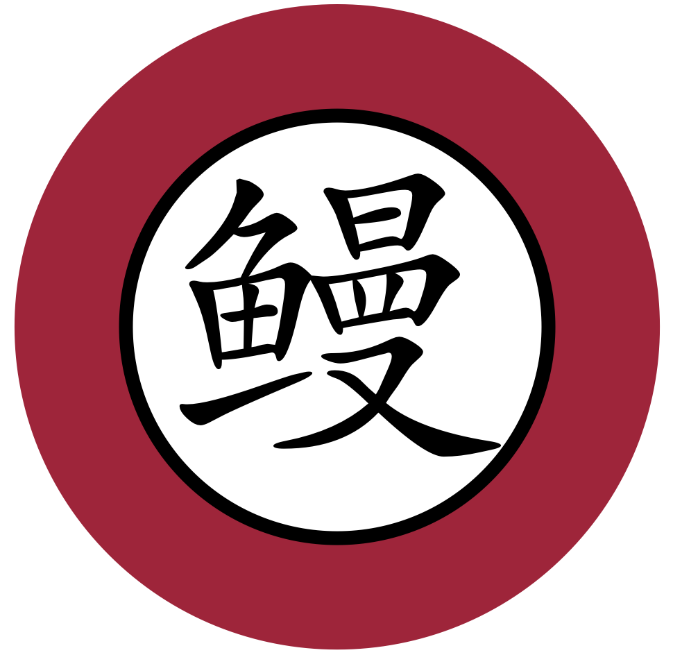

# Unagi (ウナギ)

 <!-- .element height="30%" width="30%" -->

----

Besides being the most delicious fish in the world and one of the [signature Japanese dishes](https://en.wikipedia.org/wiki/Unagi), `unagi` can also help you navigate through the [public](https://hsc.mtk.nao.ac.jp/ssp/) or [nternal data release](https://hscdata.mtk.nao.ac.jp/hsc_ssp/) of the Hyper Suprime-Cam (HSC) Subaru Strategic Program (SSP; also known as the HSC survey) -- an ambitious multi-band deeep photometric survey using the awesome prime-focus camera on the 8.2m Subaru telescope. 

Also, `unagi` does not stand for anything because forced acronym is for psychopath. 

Applications
------------

- Generate cutout coadded or warped HSC images.
- Generate 3-color RGB picture of a small HSC region.
- Query and download HSC PSF model.
- Download HSC files (coadded `Patch` or source catalogs).

Installation
------------

Right now, please just put `unagi` under your `PYTHONPATH` environment variable.

Reporting bugs
--------------

If you notice a bug in `unagi` (and you will~), please file an detailed issue at:

https://github.com/dr-guangtou/unagi/issues

Requesting features
-------------------

If you would like to request a new feature, do the same thing. 

License
-------

Copyright 2019 Song Huang and contributors.

`unagi` is free software made available under the MIT License. For details see
the LICENSE file.
